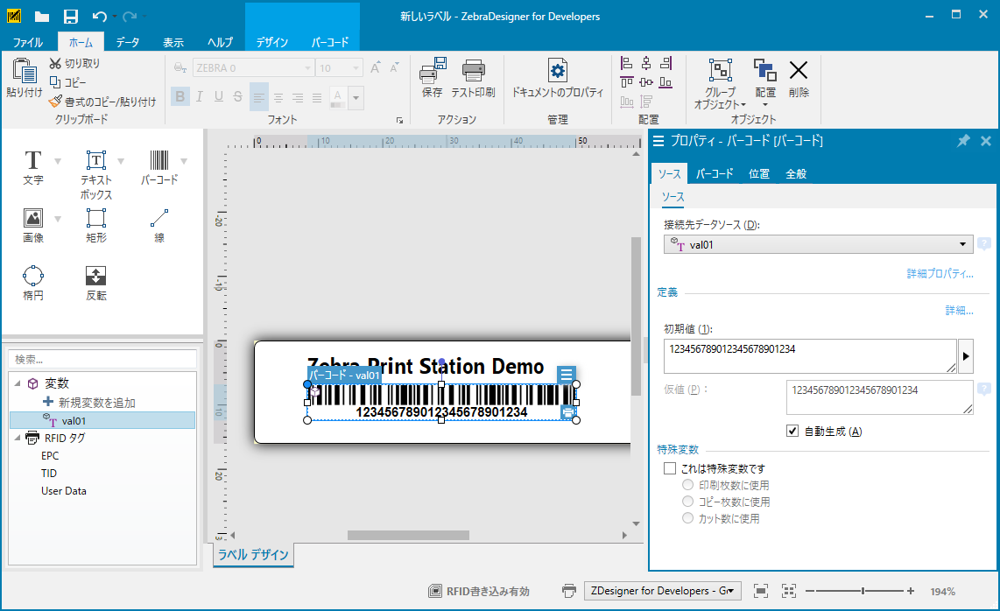
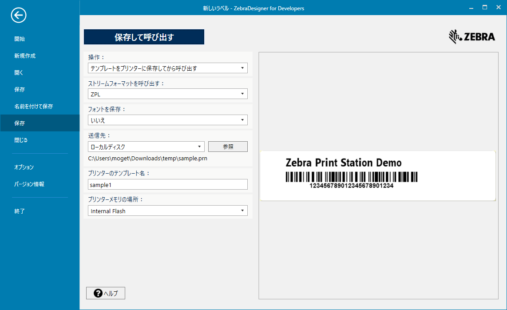
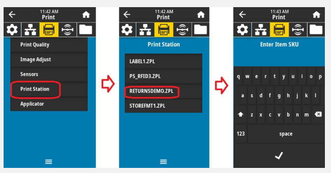

Zebra-Printer_Print-Station_Print Demo by Print Station
# Print Stationを用いた印刷デモ手順

### 準備すべきもの

**※ Zebra社のスキャナとプリンタの組み合わせで動作するように設計・テストされたソリューションになります。他社製品とのコンビネーションでは機器が正常に認識されず、動作が保証されないソリューションとなりますことご注意ください。**

|||
|-|-|
|Zebra Link-OS プリンタ |OTG USBポートがあるもの |
| Zebra DS スキャナ **※** |下記設定されているもの<br/>- スキャン後にCRLFが追加<br/>- HID出力されているもの|
| WindowsPC | 下記ソフトがインストールされているもの <br/> - Zebra Designer 3 Developers <br/>- Zebra Setup Utility |


<br/>

### PC側作業

1. Zebra Designer 3 を用いて、サンプルコードを作成する。
   - **変数を用いたコードがあることを必ず確認。**
    
2. アイコン[保存]を選択。
3. 下記図を参考に各項目を設定。
   - **送信先はローカルディスクにすること。**
  　
4. 保存したprnファイルをテキストエディタ(UTF-8)で開く。
5. ~から開始されている行を^XA(2行目)より前に移動する。
   - 例：移動前
    ```zpl
    CT~~CD,~CC^~CT~
    ^XA
    ^DFE:sample1.ZPL^FS
    ~TA000☆
    ~JSN☆
    ^LT0
    ^MNW
    ^MTT
    ^PON
    ^PMN
    ^LH0,0
    ^JMA
    ^PR8,8
    ~SD15☆
    ^JUS
    --略
    ```
    <br/>

   - 例：移動後
    ```zpl
    CT~~CD,~CC^~CT~
    ~TA000☆
    ~JSN☆
    ~SD15☆
    ^XA
    ^DFE:sample1.ZPL^FS
    ^LT0
    ^MNW
    ^MTT
    ^PON
    ^PMN
    ^LH0,0
    ^JMA
    ^PR8,8
    ^JUS
    --略
    ```

6. prnファイルを保存する。
7. prnファイルをZebra Setup Utilityなどでプリンタに送信する。

<br/>
<br/>

### デモ準備

1. プリンタの電源ON。
2. プリンタをプリンタのOTG/USBポートに接続し、通電を確認。

<br/>
<br/>

### デモ手順

1. 液晶メニューから下記を選択
  - [Print] > [Print Station] > [プリンタに送信したZPL名]

1. 入力を促されたら、スキャンする。
2. [Print Quantity]画面では印刷枚数を選択する。
3. デモ印刷が出力される。

<br/>
<br/>

### 参考資料

- [Print Station ソフトウェアを使用するためのZebraプリンタとバーコード スキャナの設定](https://support-new.zebra.com/ja/article/000026068)
- [プリントステーションのデモセットアップ | Zebra](https://www.youtube.com/watch?v=P2YLdLirN5A)
